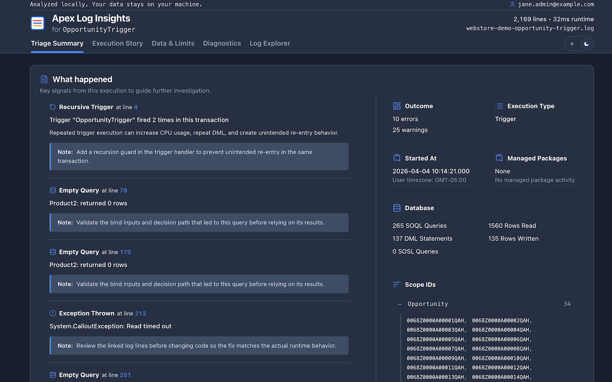

# Apex Log Insights

Apex Log Insights turns Salesforce Apex debug logs into evidence-backed, searchable reports. It is available as a browser extension, local CLI, TypeScript library, and MCP server for AI clients.

Log processing is local. The MCP server also parses locally, but its structured results are passed to your AI client; see [Privacy and security](docs/user-guides/privacy.md).

## Start here

| Your goal                           | Best option       | Guide                                                                              |
| ----------------------------------- | ----------------- | ---------------------------------------------------------------------------------- |
| Open a log and investigate visually | Browser extension | [Install and analyze a log](docs/user-guides/getting-started.md#browser-extension) |
| Analyze a log beside its source     | VS Code extension | [VS Code quick start](docs/user-guides/getting-started.md#vs-code-extension)       |
| Open local logs from a terminal     | CLI               | [CLI quick start](docs/user-guides/getting-started.md#cli)                         |
| Add parsing to an application       | Core library      | [Core API](docs/reference/api/core.md)                                             |
| Let an AI client analyze logs       | MCP server        | [MCP setup](packages/mcp/README.md)                                                |
| Contribute to the project           | Monorepo          | [Contributing](CONTRIBUTING.md)                                                    |

Install the extension from [Chrome Web Store](https://chromewebstore.google.com/detail/apex-log-insights/mkgfpohljhagepglolcabmnhhiipicdp), [Microsoft Edge Add-ons](https://microsoftedge.microsoft.com/addons/detail/apex-log-insights/nkpcmmjdldolekgajklnllilkbobbian), or [Firefox Add-ons](https://addons.mozilla.org/en-US/firefox/addon/apex-log-insights/).

<p align="center"> </p>

## What the report explains

- transaction outcome, errors, warnings, and instrumentation quality;
- execution order, context, phases, trigger cascades, recursion, and hotspots;
- SOQL, DML, callouts, named credentials, savepoints, and duplicate-query patterns;
- governor-limit trajectory, burn rate, CPU attribution, and heap usage;
- evidence links from every supported finding to the relevant raw log line.

The parser reports what the log supports. Missing debug events or insufficient debug levels can reduce confidence, and the Diagnostics view calls out those limitations.

## How transaction reconstruction works

**Apex Log Insights reconstructs the complete transaction visible in one Salesforce debug log.** It follows the execution boundary, nests code units and operations in timestamp order, and links supported conclusions to the originating log lines.

| Log evidence                                                                                           | How it is used                                                                                    |
| ------------------------------------------------------------------------------------------------------ | ------------------------------------------------------------------------------------------------- |
| `EXECUTION_STARTED` and `EXECUTION_FINISHED`                                                           | Define the outer boundary of the recorded transaction.                                            |
| `CODE_UNIT_STARTED` and `CODE_UNIT_FINISHED`                                                           | Identify the entry point and nested units such as triggers, classes, flows, and workflow actions. |
| `METHOD_ENTRY` / `METHOD_EXIT`, `DML_BEGIN` / `DML_END`, and `SOQL_EXECUTE_BEGIN` / `SOQL_EXECUTE_END` | Reconstruct nested operations and their order.                                                    |
| Timestamps and event sequence                                                                          | Preserve the timeline and calculate durations where both boundaries are available.                |
| User, execution-context, limit, validation, workflow, flow, and callout events                         | Explain what occurred inside the recorded boundary.                                               |
| Raw-line evidence references                                                                           | Let users verify findings against the source log.                                                 |

One Apex debug log represents one logged execution context—not necessarily the entire business process. Queueable jobs, future methods, batch executions, platform-event subscribers, and other asynchronous work normally run as separate transactions and produce separate logs. Investigating that work requires the related logs.

Salesforce can also truncate a log, skip sections, or omit events because of its configured debug levels. Apex Log Insights checks those conditions silently when the evidence appears complete. Triage shows a **Log quality warning** only when missing or uncertain evidence could change the interpretation. When an exception is captured, Triage shows the recorded events immediately preceding it as **Failure context**.

## Packages

| Package                          | Purpose                                          | Package guide                                       |
| -------------------------------- | ------------------------------------------------ | --------------------------------------------------- |
| `@apex-log-insights/core`        | Zero-runtime-dependency parser and report engine | [Core package](packages/core/README.md)             |
| `@apex-log-insights/cli`         | Local HTTP server and browser viewer             | [CLI package](packages/cli/README.md)               |
| `@apex-log-insights/mcp`         | Local MCP tool server                            | [MCP package](packages/mcp/README.md)               |
| `@apex-log-insights/browser-ext` | Chrome, Edge, and Firefox extension source       | [Extension package](packages/browser-ext/README.md) |
| `packages/vscode-ext`            | Installable VS Code extension and secure webview | [VS Code package](packages/vscode-ext/README.md)    |

## Documentation

The [documentation index](docs/README.md) organizes information into user guides, reference, development, and release buckets. Contributors use the [documentation standard](docs/development/documentation-standard.md) and [project terminology](docs/reference/terminology.md) when changing public text or names.

- [Getting started](docs/user-guides/getting-started.md)
- [Privacy and security](docs/user-guides/privacy.md)
- [Troubleshooting](docs/user-guides/troubleshooting.md)
- [Writing guide](docs/development/writing-guide.md)
- [Testing and coverage](docs/development/testing.md)
- [Core API](docs/reference/api/core.md)
- [Report schema](docs/reference/report-schema.md)
- [Architecture](docs/development/architecture.md)
- [Feature reference](FEATURES.md)
- [Changelog](CHANGELOG.md)

## Development

Requires Node.js 18 or later and pnpm 9.

```bash
corepack enable
corepack prepare pnpm@9.15.4 --activate
pnpm install --frozen-lockfile
pnpm format:check
pnpm audit:docs
pnpm validate
pnpm test:coverage
pnpm test:corpus
pnpm build
```

The parser retains zero runtime dependencies. Repository development uses Vitest and its V8 coverage provider; generated coverage reports stay local under the ignored `coverage/` directory.

`pnpm test:corpus` is an optional networked compatibility gate for the pinned
public Certinia Debug Log Analyzer sample. The command verifies the download,
prints privacy-safe aggregate results, and removes a newly downloaded copy
unless `--keep` is supplied. External logs remain ignored and are never part of
the npm or extension artifacts.

`pnpm format` and `pnpm format:check` discover maintained non-UI source and documentation files from Git, including non-ignored new files, while leaving generated extension/viewer bundles untouched.

`pnpm audit:docs` scores every page under `docs/` against the repository's ten structural writing checks. `pnpm validate` also runs this audit and verifies local links and heading anchors.

`pnpm build` rebuilds the current version and does not increment it. Read [Contributing](CONTRIBUTING.md) before changing code and [Releasing](docs/development/releasing.md) before changing a version.

## Support and license

[Report a bug](https://github.com/gkolan/apex-log-insights/issues) with a minimal synthetic or sanitized log. Do not attach production logs without reviewing them for sensitive data.

Licensed under the [MIT License](LICENSE).

The shared report UI is organized around Triage Summary, Execution Story, Data & Limits, Diagnostics, and Log Explorer. It renders the canonical normalized view model across every host, including execution hierarchy, lifecycle phases, resource trajectories, record and automation evidence, diagnostic attribution, and paged raw-log exploration.
