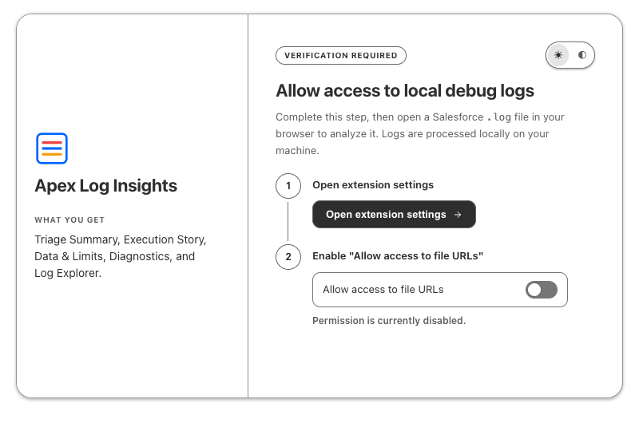
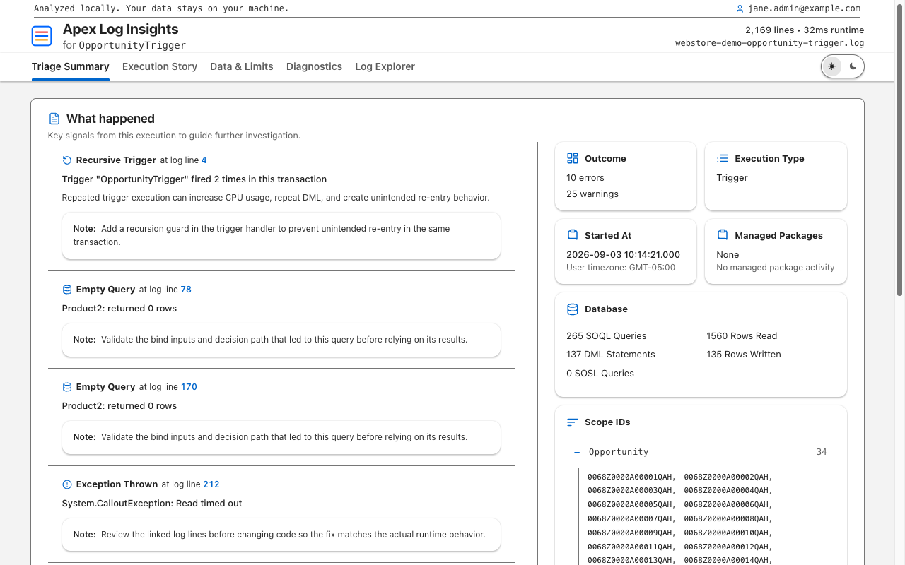
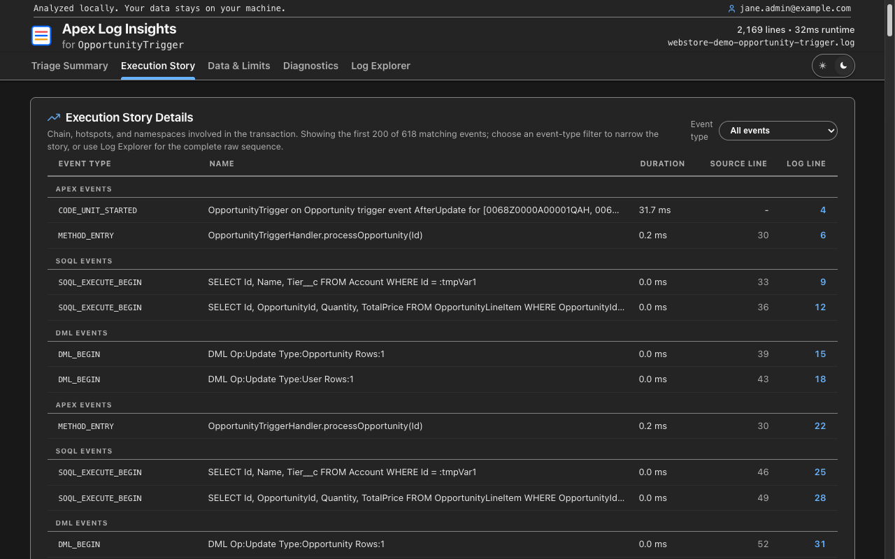

# Apex Log Insights

Apex Log Insights analyzes Salesforce Apex debug logs locally. Investigate execution order, SOQL and DML, governor limits, and errors, then follow findings to the raw log lines that support them.

Use the browser extension in Chrome, Edge, or Firefox, or build the VS Code extension, CLI, Node.js/TypeScript library, and MCP server from source.

Log processing is local. The MCP server also parses locally, but its structured results are passed to your AI client; see [Privacy and security](docs/user-guides/privacy.md).

## Installation

| Platform | Install                                                                                                                        | Status            |
| -------- | ------------------------------------------------------------------------------------------------------------------------------ | ----------------- |
| Chrome   | [Chrome Web Store](https://chromewebstore.google.com/detail/apex-log-insights/mkgfpohljhagepglolcabmnhhiipicdp)                | Available         |
| Edge     | [Microsoft Edge Add-ons](https://microsoftedge.microsoft.com/addons/detail/apex-log-insights/nkpcmmjdldolekgajklnllilkbobbian) | Available         |
| Firefox  | [Firefox Add-ons](https://addons.mozilla.org/en-US/firefox/addon/apex-log-insights/)                                           | Available         |
| VS Code  | [Build from source](docs/user-guides/getting-started.md#vs-code-extension)                                                     | Not published yet |

<!-- Publish the VS Code extension, then swap its row to: [VS Code Marketplace](https://marketplace.visualstudio.com/items?itemName=apex-log-insights.apex-log-insights) | Available -->

The CLI, core library, and MCP server are available through [source builds](docs/user-guides/getting-started.md#build-from-source). Store versions can differ from this repository; check [installation availability](docs/user-guides/getting-started.md#availability) for details.

## Analyze your first log

1. Install a browser extension from the table above and open its analyzer.
2. Drop a Salesforce Apex debug-log file ending in `.log` onto the page.
3. Start in **Triage Summary** for the transaction outcome and findings.
4. Open a finding's **Log line** link to inspect its evidence in **Log Explorer**.

For a sample without production data, download the [synthetic Opportunity trigger log](fixtures/webstore-demo-opportunity-trigger.log) using GitHub's **Download raw file** control. If the extension cannot open a local file, follow [Getting started](docs/user-guides/getting-started.md#browser-extension) and [Troubleshooting](docs/user-guides/troubleshooting.md).

## Start here

| Your goal                           | Best option       | Guide                                                                              |
| ----------------------------------- | ----------------- | ---------------------------------------------------------------------------------- |
| Open a log and investigate visually | Browser extension | [Install and analyze a log](docs/user-guides/getting-started.md#browser-extension) |
| Analyze a log beside its source     | VS Code extension | [VS Code quick start](docs/user-guides/getting-started.md#vs-code-extension)       |
| Open local logs from a terminal     | CLI               | [CLI quick start](docs/user-guides/getting-started.md#cli)                         |
| Add parsing to an application       | Core library      | [Core API](docs/reference/api/core.md)                                             |
| Let an AI client analyze logs       | MCP server        | [MCP setup](packages/mcp/README.md)                                                |
| Contribute to the project           | Monorepo          | [Contributing](CONTRIBUTING.md)                                                    |

## Screenshots

<p align="center"></p>

<p align="center"> </p>

## What the report explains

- transaction outcome, errors, warnings, and instrumentation quality;
- execution order, context, phases, trigger cascades, recursion, and hotspots;
- SOQL, DML, callouts, named credentials, savepoints, and duplicate-query patterns;
- governor-limit trajectory, burn rate, CPU attribution, and heap usage;
- evidence links from every supported finding to the relevant raw log line.

The parser reports what the log supports. Missing debug events or insufficient debug levels can reduce confidence, and the Diagnostics view calls out those limitations.

## How transaction reconstruction works

Apex Log Insights reconstructs the transaction events recorded in one Salesforce debug log. It follows the execution boundary, nests code units and operations in timestamp order, and links supported conclusions to the originating log lines.

| Log evidence                                                                                           | How it is used                                                                                    |
| ------------------------------------------------------------------------------------------------------ | ------------------------------------------------------------------------------------------------- |
| `EXECUTION_STARTED` and `EXECUTION_FINISHED`                                                           | Define the outer boundary of the recorded transaction.                                            |
| `CODE_UNIT_STARTED` and `CODE_UNIT_FINISHED`                                                           | Identify the entry point and nested units such as triggers, classes, flows, and workflow actions. |
| `METHOD_ENTRY` / `METHOD_EXIT`, `DML_BEGIN` / `DML_END`, and `SOQL_EXECUTE_BEGIN` / `SOQL_EXECUTE_END` | Reconstruct nested operations and their order.                                                    |
| Timestamps and event sequence                                                                          | Preserve the timeline and calculate durations where both boundaries are available.                |
| User, execution-context, limit, validation, workflow, flow, and callout events                         | Explain what occurred inside the recorded boundary.                                               |
| Raw-line evidence references                                                                           | Let users verify findings against the source log.                                                 |

One Apex debug log represents one logged execution context—not necessarily the entire business process. Queueable jobs, future methods, batch executions, platform-event subscribers, and other asynchronous work normally run as separate transactions and produce separate logs. Investigating that work requires the related logs.

Salesforce can also truncate a log, skip sections, or omit events because of its configured debug levels. Apex Log Insights checks those conditions silently when the evidence appears complete. Triage shows a **Log quality warning** only when missing or uncertain evidence could change the interpretation. When an exception is captured, Triage shows the recorded events immediately preceding it as **Failure context**.

## Packages

| Package                          | Purpose                                          | Package guide                                       |
| -------------------------------- | ------------------------------------------------ | --------------------------------------------------- |
| `@apex-log-insights/core`        | Zero-runtime-dependency parser and report engine | [Core package](packages/core/README.md)             |
| `@apex-log-insights/cli`         | Local HTTP server and browser viewer             | [CLI package](packages/cli/README.md)               |
| `@apex-log-insights/mcp`         | Local MCP tool server                            | [MCP package](packages/mcp/README.md)               |
| `@apex-log-insights/browser-ext` | Chrome, Edge, and Firefox extension source       | [Extension package](packages/browser-ext/README.md) |
| `packages/vscode-ext`            | Installable VS Code extension and secure webview | [VS Code package](packages/vscode-ext/README.md)    |

## Documentation

The [documentation index](docs/README.md) organizes information into user guides, reference, development, and release buckets. Contributors use the [documentation standard](docs/development/documentation-standard.md) and [project terminology](docs/reference/terminology.md) when changing public text or names.

- [Getting started](docs/user-guides/getting-started.md)
- [Privacy and security](docs/user-guides/privacy.md)
- [Troubleshooting](docs/user-guides/troubleshooting.md)
- [Writing guide](docs/development/writing-guide.md)
- [Testing and coverage](docs/development/testing.md)
- [Core API](docs/reference/api/core.md)
- [Report schema](docs/reference/report-schema.md)
- [Architecture](docs/development/architecture.md)
- [Feature reference](FEATURES.md)
- [Changelog](CHANGELOG.md)

## Development

Requires Git, Node.js 18 or later, and pnpm 9.15.4. Follow the [prerequisite setup](CONTRIBUTING.md#prerequisites) if pnpm is not installed.

```bash
git clone https://github.com/gkolan/apex-log-insights.git
cd apex-log-insights
pnpm install --frozen-lockfile
pnpm validate
pnpm build
```

The parser retains zero runtime dependencies. Development dependencies include
Secretlint and `eslint-plugin-security` for the release security gate. See the
[contribution guide](CONTRIBUTING.md) for the full command table, bug-fix
workflows, and test-data rules, and [Releasing](docs/development/releasing.md)
before changing a version.

## Support and license

Send feedback, questions, or suggestions to [feedback@apexloginsights.com](mailto:feedback@apexloginsights.com).

[Report a bug or request a feature](https://github.com/gkolan/apex-log-insights/issues/new/choose). Attach a minimal synthetic or sanitized log; do not attach production logs without reviewing them for sensitive data.

Licensed under the [MIT License](LICENSE). Vendored third-party code is listed in [third-party notices](THIRD-PARTY-NOTICES.md).
